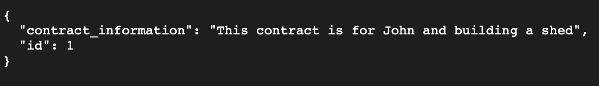
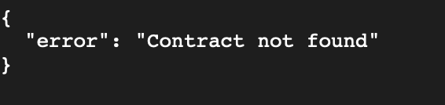
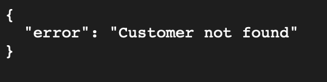

📌 Overview
A small Flask application that manages contract and customer lookups while demonstrating correct HTTP response codes: 200, 204, and 404.
1. Routes
GET /contract/<id>
200: Contract found → returns contract data
404: Contract not found
Example 200 response:
{
  "id": 1,
  "contract_information": "This contract is for John and building a shed"
}
GET /customer/<customer_name>
204: Customer exists → returns no content (sensitive data)
404: Customer not found
Example 204:
Status: 204
(no response body)
2. Running the App
pipenv install
pipenv shell
python app.py
Server runs on:
http://localhost:5555

3. Screenshots

